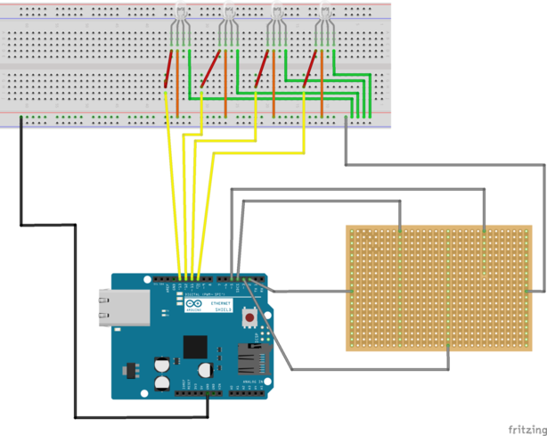

# Projektname: Pfad-Findr        

Pfad-Findr ist ein spiel mit leitfähiger Knete. Es ermöglicht eine spielerische einführung in das Thema Elektrizität und Stromkreise.
## Zielgruppe

Pfadfinder*innen // Ranger/Rover

## Materialbedarf
+ leitende Knete
+ Spielbrett aus Holz
+ Spielkarten

### Rezept für leitende Knete
Quelle: [squishycircuits.com](https://squishycircuits.com)
#### Materialien:
+ 355 mL (= 1 ½ Cup oder 13 EL bzw. 248 g) Mehl
+ 237 mL (= 1 Cup) Wasser
+ 59 mL (= ¼ Cup oder 5 EL bzw. 80 g) Salz
+ 133 mL (= 9 EL) Zitronensaft  
+ 15 mL (= 1 EL) Pflanzenöl
+ Optional: Lebensmittelfarbe

#### Herstellung:
1. Mische Wasser, 1 Cup Mehl, Salz, Zitronensaft, Pflanzenöl und falls benutzt die Lebensmittelfarbe in einem Topf, am besten antihaft-beschichtet.
2. Bei mittlerer Hitze langsam köcheln lassen und gut umrühren. Die Mischung dickt an und fängt an zu klumpen.
3. Weiter erhitzen und rühren bis sich ein großer Ball Knete gebildet hat.
4. Den Ball auf einem Mehl bestäubten Tisch abkühlen lassen (Achtung: heiß!).
5. Nach dem Abkühlen so lange Mehl einkneten bis die gewünschte Konsistenz erreicht ist.

#### Lagerung:
Luftdicht verpackt hält sich die Knete mehrere Wochen und kann für längere Lagerung eingefroren werden. Kondenswasser in der Verpackung vor Benutzung einfach wieder in die Knete einkneten.

Für isolierende Knete eignet sich handelsübliche Bastelknete, sonst gibt es online auch ein Rezept für nicht leitende Knete.

#### Dateien von squishycircuits.com - Rezepte
+ [Making Conductive Dough](appendix/Making-Conductive-Dough.pdf)
+ [Making Insulating Dough](appendix/Making-Insulating-Dough.pdf)

## Aufbau

## Quelltext

[Pfad-Findr.ino](code/Pfad-Findr.ino)

## Credits

Das Projekt ist in Kooperation mit der Hochschule München (Vertreten durch Prof. Dr. Angelika Beranek und Dominik Hanakam FK11) entstanden und wurde durch QualiFIVE gefördert.