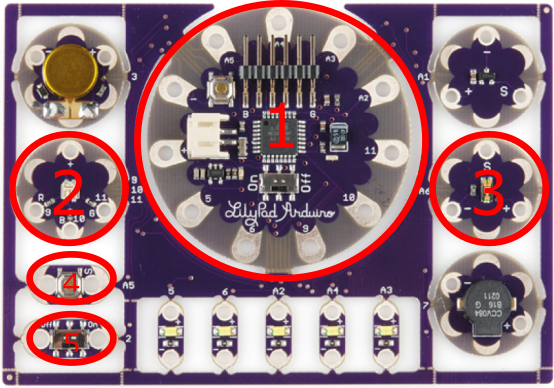
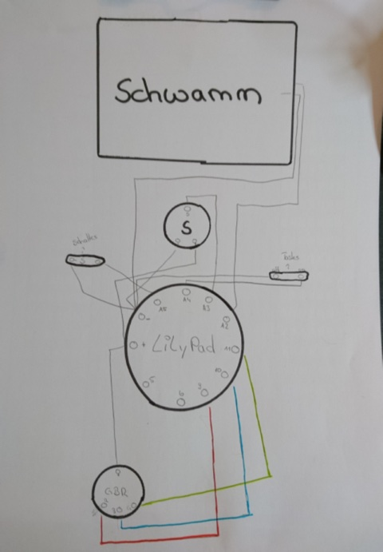
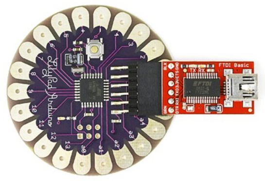
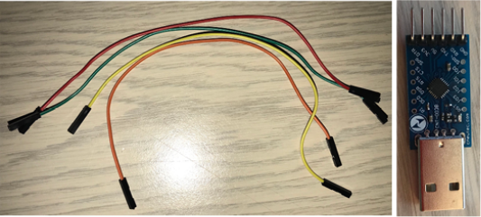
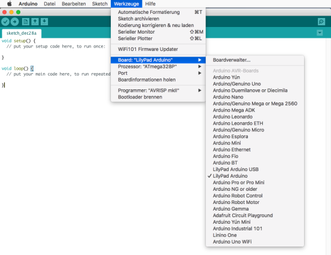

# Projektname: Zombie-Run        

Bei "Zombie Night" handelt es sich um ein Nachtgelände Adventure Spiel, bei dem zwei Teams gegeneinander antreten (mind. 8 Spieler). Ein Team nimmt dabei die Rolle der "Zombies" ein, während das andere Team die Rolle der "Überlebenden" einnehmen. Zu Beginn gibt es genauso viele Zombies wie Überlebende. Das "Zombie" Team muss versuchen alle Überlebende zu "infizieren" während die Überlebenden darauf achten müssen nicht "infiziert" zu werden. Im Team der Überlebenden gibt es immer einen "Heiler", der versuchen muss die Zombies zu heilen.

**Zielgruppe:** Pfadfinder*innen

## Material 

- 1x Lilypad
- 1x Rolle Isolierkabel um 12x Kabel zuzuschneiden
- Lötzinn
- Haussschwamm (nicht leitend)
- Kupferband
- Stoff
- Gummiband (optional)
- Armbinde (optional)

## Werkzeuge

- Heißkleberpistole
- Lötkolben mit Lötzinn
- Laptop / Computer mit Arduino IDE Installation (Download unter: https://www.arduino.cc/en/Main/Software)
- Schere / Messer, o.Ä.
- USB-TTL Adapter, um PC mit Lilypad zu verbinden
- Steckbrücken (optional)
- Abisolierzange

## Umsetzung

### Lilypad Vorbereiten

Beim Lilypad Arduino Entwicklungsboard handelt es sich um einen Arduino-kompatiblen Mikrocontroller mit analogen, sowie digitalen Ausgängen. Es ist mit Hilfe der Arduino IDE frei programmierbar (Download unter: https://www.arduino.cc/en/Main/Software). Aufgrund der modularen Bauweise des Lilypad, und der daraus resultierenden Erweiterbarkeit dieses Arduino Boards ist es ideal geeignet für "Wearables". In dieser Bauanleitung bzw. Projekt wurde das "Lilypad – protosnap" eingesetzt, da es bereits diverse Module mit sich bringt. Im folgenden Abschnitt werden die einzelnen Komponenten kurz erläutert, die für das "Zombie-Kit" benötigt werden.

- **Hauptplatine (1)** – Hier handelt es sich um den eigentlichen Mikrocontroller. Alle Befehle, die programmiert werden, werden von der Hauptplatine verarbeitet und an die weiteren Komponenten weitergegeben.
- **RGB – LED (2)** – Hier liegt die RGB (Red-Green-Blue) LED. Durch bestimmte Programmierbefehle kann die LED in ver- schiedenen Farben leuchten.
- **Lichtsensor (3)** – Diese Komponente reagiert auf Lichtreize und kann dies der Hauptplatine mitteilen. Dies kann genutzt werden um auf Lichtquellen bestimmte Aktion folgen zu lassen.
- **Taster (4)** – Der Taster reagiert auf Druck. Mit Hilfe des Tasters kann man auf, z.B. Druck durch einen Finger reagieren (im weiteren Verlauf wird der Taster mitverwendet. Dieser ist allerdings optional, da die RGB – LED für das Projekt hauptsächlich auf Lichtquellen reagieren soll).
- **Ein-/Ausschalter (4)** – Mit dieser Schalter kann man das Lilypad Ein-, bzw. ausschalten.

Um das "Zombie-Kit" bauen zu können, werden die vier, oben ge- nannten Komponente des Lilypad benötigt. Diese müssen zunächst aus der Schablone vorsichtig herausgebrochen werden.

### Aufbau

1. Als Erstes platziert man die benötigten Platinen auf ein ca. arm- breites Stück Stoff. Wichtig ist, dass man sich hierbei bereits über die Anordnung der Platinen Gedanken macht. Da, diese spä- ter mit Kabeln miteinander verlötet werden (s. Schaltplan im An- hang). Hat man die Einzelteile richtig platziert, können diese im Anschluss mit einem Heißkleber auf dem Stoff fixiert werden.
2. Als nächstes schneidet man ein ungefähr 2cm großes Loch in den Schwamm. Anschließend klebt man auf die Unter- und Ober- seite des Schwammes ein Stück Kupferband. Das Loch sollte von dem Kupferband abgedeckt sein. Wenn man nun mit der flachen Hand nun auf dem Schwamm drückt, oder klopft, sollten sich die beiden Kupferbänder bei dem Loch berühren können. Dadurch wird später der Stromkreislauf geschlossen und die Berührung kann somit registriert werden. An beiden Kupferbänder müssen zum Schluss noch jeweils ein Kabel angelötet werden. Der fertige Schwamm wird anschließend ebenfalls auf dem Stoff angebracht und fixiert.
3. Beim nächsten Schritt werden alle Komponenten zusammen an den jeweiligen Ports (Löcher) an den Platinen verbunden bzw. verlötet, sodass sie miteinander kommunizieren können.

### Programmierung

#### Lilypad mit dem Computer verbinden

Um den Code auf die Hauptplatine draufspielen zu können ("Flashen") muss man die Hauptplatine mit einem Computer verbinden, auf dem später der Code programmiert wird. Hier kommt der USB-TTL Adapter ins Spiel. Dieser wird mit Hilfe eines USB-Kabels an den Computer angeschlossen. Der Adapter wird, je nach Modell entweder direkt mit der den Kontaktstiften des Lilypads. 

Oder mit Hilfe von sogenannten Steckbrücken angeschlossen. Verbindet man das Lilypad mit Hilfe von Steckbrücken, muss darauf geachtet werden, dass man welche mit "Löchern" an beiden Ende hat, da es auch welche mit "Stiften" an den Enden gibt.

#### Eintwicklungsumgebung einrichten / starten

Hat man den Computer erfolgreich mit der Hauptplatine des Lilypad angeschlossen kann man mit der Programmierung des Codes begin- nen. Dies wird mit Hilfe des Programms "Arduino" bewerkstelligt und kann direkt von der Arduino Homepage heruntergeladen werden (www.arduino.cc/en/Main/Software). Es gibt dabei eine Cloud-basierte Version, "Arduino Web Editor", sowie eine lokale Version, "Arduino IDE" (IDE = integrated development environment; dt: Entwicklungsumgebung). Die lokale Version existiert für Windows, Mac OSX sowie Linux.

Öffnet man das Programm befindet man sich bereits direkt auf der Programmieroberfläche, wo man den Code schreiben kann. Hier sollte man zunächst dem Programm mitteilen, dass man auf einem Lilypad programmiert.

#### Code Schreiben

Hat man die ersten Einstellungen getätigt, kann es direkt in die Programmierung gehen. Um eine Idee dafür zu bekommen wie und was man programmieren kann, gibt es vorgefertigte "Code-Snippets" (Vorlagen), welche man öffnen kann. Für dieses Projekt wurde das Code Beispiel "BlinkWithoutDelay" ausgewählt und als Grundgerüst benutzt. 

Es ist ratsam die verschiedenen Code Vorlagen zu versuchen zu verstehen. Für dieses Projekt kann jedoch zunächst der Code aus dem Anhang <!-- TODO: link code //--> kopiert werden.

#### Code Kompilieren

Hat man den Code fertig geschrieben, muss dieser noch "kompiliert" werden. Das bedeutet, dass der zuvor geschriebene Code in einen für den Computer verständlichen bzw. ausführbaren Code, umgewandelt werden muss. Hierbei wird der Code auch auf Programmierfehler geprüft, und man bekommt einen Hinweis, falls man einen fehlerhaften Code geschrieben hat.

In der "Konsole" wird ausgegeben, ob das "Kompilieren" erfolgreich war oder nichtIst die "Kompilierung" erfolgreich gewesen, kann der Code nun auf das "Lilypad" "hochgeladen", bzw. "geflasht" werden. Hierzu klickt man, bei angeschlossenen Lilypad (s. Beginn des Kapitels) auf den Button "Hochladen" klicken. Dieser befindet sich rechts neben dem "Überprüfen" Button.

### Auf Funktion Prüfen

Hat man den Code auf das Lilypad geladen, muss das "Zombie-Kit" nur noch auf Funktion getestet werden. Wenn man es einschaltet sollte die LED zunächst grün blinken (Mensch / Überlebender). Klopft man nun auf den Schwamm sollte die LED anschließend rot blinken (Infizierter / Zombie). Als nächstes leuchtet man in mög- lichst dunkler Umgebung auf den Lichtsensor. Nun sollte die LED wieder grün blinken.

***HINWEIS:***
Bei Dunkelheit die Taschenlampe, die für die Zombie Night genutzt wird, über den Sensor halten und überprüfen welcher Lichtwert (im Code rot markiert) eingegeben werden muss! Wahrscheinlich muss ein niedrigerer Wert eingegeben werden, als bei Tageslicht. Funktioniert nun alles wie gewünscht, muss das Zombie-Kit nur noch mit dem Stoff verkleidet und mit zwei Bändern beschmückt werden, sodass es an den Arm eines Spielers angebracht werden kann.

## Credits

- Michael La
- Kathrin Gökceli
- Elisabeth Pohl
- Robert (Döner) Walther
- Julian Schaible

## Anhang

- [Spielanleitung](data/spielanleitung.pdf)
- [Code](code/zombie-run.ino)